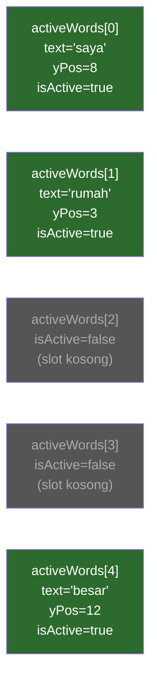
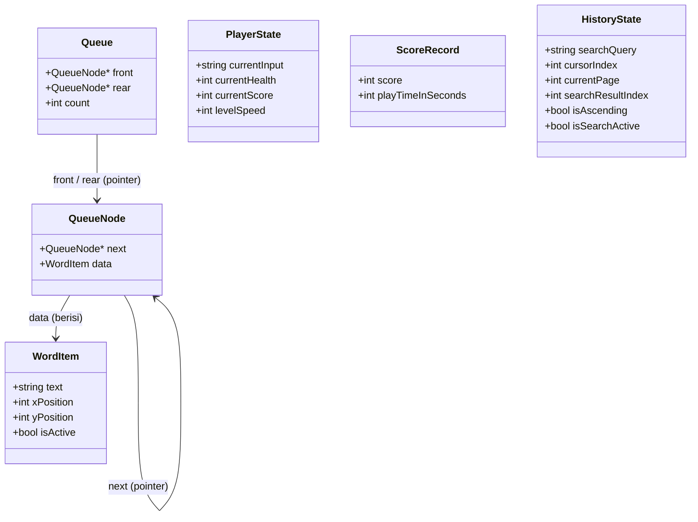
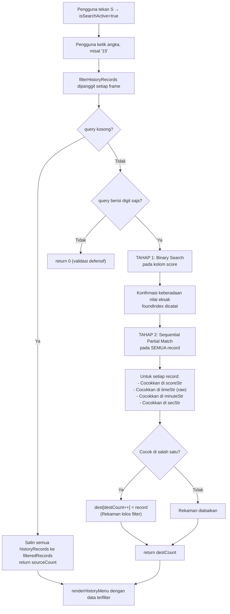
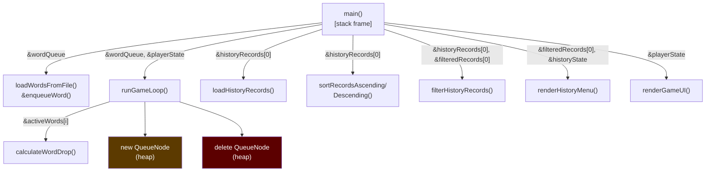

# Analisis Pemenuhan Syarat Final Project Struktur Data

> **Tujuan Dokumen**: Membuktikan secara teknis dan mendalam bahwa setiap syarat wajib dan pilihan dari mata kuliah Struktur Data telah dipenuhi di aplikasi TemiTik, beserta justifikasi mengapa implementasi tersebut dipilih di lokasi tersebut — bukan di tempat lain, dan bukan dengan struktur data yang lain.

---

## Ringkasan Status Pemenuhan Syarat

| # | Kategori | Syarat | Status | Lokasi Utama |
|---|----------|--------|--------|--------------|
| a | **WAJIB** | Array | ✅ Terpenuhi | `gameEngine.cpp`, `main.cpp`, `history.cpp` |
| b | **WAJIB** | Struct | ✅ Terpenuhi | `dataStructs.h` (5 struct) |
| c | **WAJIB** | Sorting | ✅ Terpenuhi | `history.cpp` — Bubble Sort manual |
| d | **WAJIB** | Searching | ✅ Terpenuhi | `history.cpp` — Binary Search + Partial Match |
| e | **WAJIB** | Pointer | ✅ Terpenuhi | Seluruh codebase — pass-by-pointer |
| - | **PILIHAN** | Queue | ✅ Terpenuhi | `loader.cpp` + `gameEngine.cpp` — Linked List Queue |
| - | **BONUS** | Linked List | ✅ Terpenuhi | Implementasi Queue berbasis Linked List |

---

## BAGIAN I — SYARAT WAJIB

---

## A. Array

### Lokasi Penggunaan

Array digunakan di **tiga titik berbeda** dalam kode, masing-masing dengan justifikasi yang berbeda.

### A.1 — `activeWords[MAX_ACTIVE_WORDS]` di `gameEngine.cpp`

**Deklarasi (baris 47):**
```cpp
// gameEngine.cpp, baris 47
WordItem activeWords[MAX_ACTIVE_WORDS]; // = WordItem activeWords[5]
```

**Akses index langsung (contoh dari baris 124–158):**
```cpp
for (int i = 0; i < MAX_ACTIVE_WORDS; i++) {
    if (activeWords[i].isActive) {
        calculateWordDrop(&activeWords[i]);       // akses via index i
        // ... cek tabrakan, kurangi nyawa
    }
}
```

**Pertimbangan: Mengapa Array, bukan Linked List di sini?**

Perbandingan teknis antara kedua pilihan struktur data:

| Kriteria | Array `activeWords[5]` | Linked List |
|----------|----------------------|-------------|
| Akses per elemen per frame | **O(1)** — langsung via index | O(n) — harus traversal |
| Jumlah slot | **Tetap 5** — sesuai konstanta `MAX_ACTIVE_WORDS` | Dinamis (tidak perlu) |
| Random access untuk auto-aim | **Bisa langsung**: `activeWords[targetWordIndex]` | Harus cari dari head |
| Collision detection (AABB) | **Loop sederhana** antar dua index | Loop bertingkat lebih rumit |
| Memory overhead | **Minimal** — hanya 5 slot di stack | Pointer `next` per node = overhead |
| Alokasi | **Stack** — otomatis, cepat | Heap — perlu `new`/`delete` |

> **Kesimpulan**: Array dipilih karena jumlah kata aktif **selalu dibatasi 5** (konstanta `MAX_ACTIVE_WORDS = 5`). Tidak ada kebutuhan ukuran dinamis. Yang terpenting adalah **akses O(1) via index** untuk keperluan rendering real-time per frame dan operasi auto-aim yang harus menunjuk `activeWords[targetWordIndex]` secara langsung tanpa traversal.



### A.2 — `historyRecords[MAX_HISTORY_RECORDS]` di `main.cpp`

**Deklarasi (baris 88):**
```cpp
// main.cpp, baris 88
ScoreRecord historyRecords[MAX_HISTORY_RECORDS]; // = ScoreRecord[100]
```

**Pertimbangan: Mengapa Array, bukan Linked List di sini?**

| Kriteria | Array `historyRecords[100]` | Linked List |
|----------|---------------------------|-------------|
| Operasi utama | **Bubble Sort in-place** | Sort pada Linked List jauh lebih kompleks |
| Binary Search | **Wajib array terurut** — akses index `source[mid]` | Binary Search tidak bisa diterapkan langsung |
| Kapasitas | **Maks 100 rekaman** — batas realistis | Dinamis, tapi tidak dibutuhkan |
| Data bersifat | **Sekumpulan nilai yang sama** (ScoreRecord) | Lebih cocok untuk data heterogen |

> **Kesimpulan**: Bubble Sort dan Binary Search **secara algoritmik memerlukan array**. Binary Search bergantung pada kemampuan **mengakses elemen tengah (`mid`) dalam O(1)** menggunakan indeks. Jika memakai Linked List, untuk mencapai elemen ke-`mid` harus traversal dari head — kompleksitas Binary Search yang harusnya O(log n) akan menjadi O(n log n). Array adalah satu-satunya pilihan yang tepat di sini.

### A.3 — `filteredRecords[MAX_HISTORY_RECORDS]` di `main.cpp`

**Deklarasi (baris 94):**
```cpp
// main.cpp, baris 94
ScoreRecord filteredRecords[MAX_HISTORY_RECORDS]; // Array buffer hasil filter
int filteredCount = recordCount;
```

Array ini menampung **salinan subset** dari `historyRecords` setelah difilter oleh `filterHistoryRecords()`. Hasilnya kemudian langsung diteruskan ke `renderHistoryMenu()` untuk ditampilkan.

---

## B. Struct

### Lokasi Penggunaan

Semua struct dideklarasikan terpusat di [[include/dataStructs.h]] sebagai **Single Source of Truth**. Ada **5 struct** dan **1 enum** di file tersebut.

### B.1 — `struct WordItem`

```cpp
// dataStructs.h, baris 73-78
struct WordItem {
    std::string text;  // Teks kata ("sebagai", "saya", dll.)
    int xPosition;     // Kolom terminal tempat kata digambar
    int yPosition;     // Baris terminal tempat kata digambar
    bool isActive;     // true = sedang jatuh, false = sudah mati
};
```

**Mengapa butuh Struct?**
Satu kata yang jatuh di layar memiliki **4 properti berbeda tipe** yang tidak bisa dipisah — koordinat X/Y untuk rendering, teks untuk pencocokan input, dan flag aktif untuk lifecycle management. Tanpa struct, harus ada 4 array terpisah (`texts[]`, `xPos[]`, `yPos[]`, `isActive[]`) yang sangat rawan desync dan sulit dikelola.

**Di mana digunakan:**
- Di dalam `QueueNode.data` (di Queue)
- Di dalam `activeWords[5]` (di game loop)
- Di-passing via pointer `WordItem*` ke `calculateWordDrop()` dan `validatePlayerInput()`

### B.2 — `struct QueueNode`

```cpp
// dataStructs.h, baris 105-108
struct QueueNode {
    QueueNode* next;  // Pointer ke node berikutnya (8 byte — struct packing)
    WordItem data;    // Data kata yang dibawa node ini
};
```

**Mengapa butuh Struct?**
Ini adalah **building block** dari Linked List Queue. Setiap node harus membawa DUA hal: datanya (`WordItem`) dan arah ke node berikutnya (`next`). Tanpa struct, dua hal ini tidak bisa digabungkan menjadi satu unit alokasi di heap.

### B.3 — `struct Queue`

```cpp
// dataStructs.h, baris 117-121
struct Queue {
    QueueNode* front;  // Pointer ke node terdepan (untuk dequeue)
    QueueNode* rear;   // Pointer ke node terbelakang (untuk enqueue)
    int count;         // Jumlah elemen aktif
};
```

**Mengapa butuh Struct?**
Queue perlu **melacak dua ujung sekaligus** (front untuk dequeue O(1), rear untuk enqueue O(1)) plus counter. Tanpa struct, ketiga variabel ini akan melayang sebagai variabel global — sulit dipass ke fungsi, sulit dikelola state-nya.

### B.4 — `struct PlayerState`

```cpp
// dataStructs.h, baris 91-96
struct PlayerState {
    std::string currentInput; // Teks yang sedang diketik pemain
    int currentHealth;        // Sisa nyawa
    int currentScore;         // Skor terkini
    int levelSpeed;           // Kecepatan jatuh kata
};
```

**Mengapa butuh Struct?**
Keempat field ini adalah **status pemain yang harus selalu bersama** — skor mempengaruhi speed, health menentukan game over, input dipakai untuk auto-aim. Dengan struct, seluruh state pemain diteruskan ke fungsi-fungsi lain hanya dengan **satu pointer**: `runGameLoop(PlayerState* playerState, ...)`.

### B.5 — `struct ScoreRecord`

```cpp
// dataStructs.h, baris 83-86
struct ScoreRecord {
    int score;             // Skor akhir sesi
    int playTimeInSeconds; // Durasi bermain dalam detik
};
```

**Mengapa butuh Struct?**
Skor dan waktu bermain adalah **satu kesatuan rekaman** — tidak boleh dipisah. Saat di-sort, keduanya harus bergerak bersama. Jika dua array terpisah (`scores[]` dan `times[]`), proses swap pada Bubble Sort hanya akan menukar satu array sementara array lain tidak ikut tertukar — **data corrupt**.

### B.6 — `struct HistoryState`

```cpp
// dataStructs.h, baris 130-137
struct HistoryState {
    std::string searchQuery; // Query pencarian
    int cursorIndex;         // Posisi kursor >>
    int currentPage;         // Halaman aktif
    int searchResultIndex;   // Hasil Binary Search
    bool isAscending;        // Mode sort
    bool isSearchActive;     // Mode input pencarian
};
```

**Mengapa butuh Struct?**
State navigasi layar History terdiri dari 6 variabel yang saling berkaitan (contoh: `currentPage` harus di-reset ke 0 saat `searchQuery` berubah). Dengan struct, semua state ini dibawa dalam **satu pointer** `HistoryState* state` ke `renderHistoryMenu()`.

### Diagram Relasi Antar Struct



---

## C. Sorting

### Lokasi Penggunaan

Sorting diimplementasikan di [[src/history.cpp]] dengan **dua fungsi Bubble Sort manual**: `sortRecordsAscending()` dan `sortRecordsDescending()`.

### Implementasi Bubble Sort

**Ascending (baris 138–154):**
```cpp
void sortRecordsAscending(ScoreRecord* records, int count) {
    for (int i = 0; i < count - 1; i++) {           // Pass ke-i
        for (int j = 0; j < count - i - 1; j++) {   // Jangkauan menyusut
            if (records[j].score > records[j + 1].score) {
                ScoreRecord temp   = records[j];      // Swap manual (tanpa std::swap)
                records[j]         = records[j + 1];
                records[j + 1]     = temp;
            }
        }
    }
}
```

**Descending (baris 166–181):** Identik, hanya kondisi swap dibalik ke `<`.

### Visualisasi Proses Bubble Sort (Ascending, 4 data)

```
Data awal:  [200, 90, 150, 30]

Pass i=0:
  j=0: 200 > 90  → swap → [90, 200, 150, 30]
  j=1: 200 > 150 → swap → [90, 150, 200, 30]
  j=2: 200 > 30  → swap → [90, 150, 30, 200] ← 200 sudah di posisi akhir ✓

Pass i=1:
  j=0: 90 > 150  → tidak swap
  j=1: 150 > 30  → swap → [90, 30, 150, 200] ← 150 sudah di posisi akhir ✓

Pass i=2:
  j=0: 90 > 30   → swap → [30, 90, 150, 200] ✓

Hasil akhir: [30, 90, 150, 200]
```

### Kapan Sorting Dipanggil?

```cpp
// main.cpp, baris 227-231 — dipanggil SETIAP FRAME di state History
if (historyState.isAscending) {
    sortRecordsAscending(historyRecords, recordCount);
} else {
    sortRecordsDescending(historyRecords, recordCount);
}
```

**Mengapa setiap frame?** Agar perubahan mode sort (tekan A → ASC, tekan D → DESC) langsung terefleksi di tampilan tanpa state tambahan.

### Pertimbangan Pemilihan Algoritma Sort

| Algoritma | Kompleksitas | Keterangan |
|-----------|-------------|------------|
| **Bubble Sort** ✅ | O(n²) | **Digunakan**: setiap perbandingan langsung menghasilkan swap; alur kerja algoritma linear dan mudah ditelusuri; performa memadai untuk `historyRecords ≤ 100` |
| Selection Sort | O(n²) | Serupa Bubble Sort, tetapi swap hanya terjadi sekali per pass — hasil akhir sama, namun jumlah swap lebih sedikit |
| Quick Sort | O(n log n) | Lebih efisien, tetapi implementasi rekursif lebih kompleks dan berada di luar cakupan algoritma manual yang dispesifikasikan PRD |

> PRD dan Skill sheet secara eksplisit menyebutkan "Selection Sort atau Bubble Sort" sebagai algoritma yang sesuai dengan ketentuan mata kuliah.

### Sorting pada Struct — Mengapa ScoreRecord harus bergerak bersama?

```
Sebelum swap (j=1):     [ScoreRecord{90,45}, ScoreRecord{30,187}]
Setelah swap:           [ScoreRecord{30,187}, ScoreRecord{90,45}]

Jika score dan time di array terpisah (SALAH):
  scores[]  = [90, 30]  → swap → [30, 90] ✓
  times[]   = [45, 187] → (tidak diswap!)

Hasil: skor 30 berpasangan dengan waktu 45 (SALAH, harusnya 187)
```

Inilah mengapa **struct ScoreRecord** wajib ada: Bubble Sort harus menukar **keseluruhan record** agar data tidak korup.

---

## D. Searching

### Lokasi Penggunaan

Searching diimplementasikan di [[src/history.cpp]] dalam fungsi `filterHistoryRecords()`, menggunakan **dua algoritma sekaligus**:
1. **Binary Search** — untuk konfirmasi nilai eksak pada kolom score
2. **Sequential Partial Match** — untuk pencocokan substring pada semua field numerik

### D.1 — Algoritma Binary Search (Tahap 1)

```cpp
// history.cpp, baris 235-257
int left = 0, right = sourceCount - 1;
int foundIndex = -1;

while (left <= right) {
    int mid = left + (right - left) / 2;  // Aman dari integer overflow

    if (source[mid].score == exactTarget) {
        foundIndex = mid; break;           // Nilai eksak ditemukan
    }

    if (isAscending) {
        // Array ASC: nilai besar di kanan
        if (source[mid].score < exactTarget) left = mid + 1;
        else right = mid - 1;
    } else {
        // Array DESC: nilai besar di kiri
        if (source[mid].score > exactTarget) left = mid + 1;
        else right = mid - 1;
    }
}
```

**Visualisasi Binary Search** (mencari 90 di array [30, 90, 150, 200]):

```
Iterasi 1: left=0, right=3, mid=1
  source[1].score = 90 == 90 → DITEMUKAN! foundIndex=1
  (Kasus terbaik: O(1) jika langsung ketemu di mid)

Contoh lain, mencari 150 di [30, 90, 150, 200]:
Iterasi 1: left=0, right=3, mid=1 → source[1]=90 < 150 → left=2
Iterasi 2: left=2, right=3, mid=2 → source[2]=150 == 150 → DITEMUKAN!
```

**Mengapa Binary Search butuh Array yang sudah terurut?**

Binary Search bergantung pada asumsi bahwa data sudah **monoton** (naik atau turun). Dengan asumsi ini, saat `source[mid] < target`, kita tahu dengan pasti target ada di **kanan** — tidak perlu cek kiri. Inilah mengapa `sortRecordsAscending/Descending` **wajib dipanggil sebelum** `filterHistoryRecords`.

**Mengapa Binary Search tidak bisa dipakai langsung pada Linked List?**
Untuk Binary Search, kita butuh mengakses elemen ke-`mid` dalam O(1). Di array: `source[mid]` — langsung. Di Linked List: harus traversal dari head sejumlah `mid` node — O(n). Ini menghancurkan keuntungan Binary Search (O(log n) menjadi O(n log n)).

### D.2 — Sequential Partial Match (Tahap 2)

Binary Search hanya menemukan nilai **eksak** pada kolom score. Tapi pengguna ingin mencari secara lebih fleksibel — misalnya ketik "2" dan semua record yang mengandung angka "2" (di score maupun waktu) akan muncul. Untuk ini digunakan **Partial Match manual**:

```cpp
// history.cpp, baris 267-346
for (int i = 0; i < sourceCount; i++) {
    string scoreStr  = to_string(source[i].score);                  // "150"
    string timeStr   = to_string(source[i].playTimeInSeconds);      // "187"
    string minuteStr = to_string(source[i].playTimeInSeconds / 60); // "3"
    string secStr    = to_string(source[i].playTimeInSeconds % 60); // "7"

    // Pencocokan substring manual — TANPA string::find()
    // Loop j: posisi awal kandidat substring
    // Loop k: bandingkan karakter per karakter
    for (int j = 0; j <= (int)(scoreStr.length() - query.length()); j++) {
        bool match = true;
        for (int k = 0; k < (int)query.length(); k++) {
            if (scoreStr[j + k] != query[k]) { match = false; break; }
        }
        if (match) { foundInScore = true; break; }
    }

    if (foundInScore || foundInTime) {
        dest[destCount++] = source[i]; // Rekaman lolos filter
    }
}
```

**Mengapa 4 representasi waktu?** Karena waktu ditampilkan sebagai "3m 7s" (bukan "187"), maka jika user mengetik "3" atau "7", harus cocok dengan menit dan detik juga, bukan hanya raw detik.

### Diagram Alur Searching Lengkap



---

## E. Pointer

### Lokasi Penggunaan

Pointer digunakan secara **pervasif** di seluruh codebase sebagai mekanisme **pass-by-pointer** untuk efisiensi memori dan modifikasi state antar fungsi.

### E.1 — Pointer untuk Modifikasi State Antar Fungsi

```cpp
// gameEngine.h, baris 25
void runGameLoop(PlayerState* playerState, GameState& currentState, Queue* wordQueue);
```

`PlayerState*` diteruskan sebagai pointer agar `runGameLoop` bisa **langsung memodifikasi** health, score, speed, dan input di variabel yang sama yang hidup di stack `main()`. Tanpa pointer, harus menggunakan return value dan `playerState` di `main()` tidak akan berubah.

### E.2 — Pointer untuk Linked List Queue

Pointer adalah **fondasi** dari Linked List Queue:

```cpp
// dataStructs.h, baris 105-121
struct QueueNode {
    QueueNode* next;   // Pointer ke node berikutnya
    WordItem data;
};

struct Queue {
    QueueNode* front;  // Pointer ke depan antrean
    QueueNode* rear;   // Pointer ke belakang antrean
    int count;
};
```

Tanpa pointer, Linked List tidak bisa dibuat — setiap node harus bisa "menunjuk" ke node lain di lokasi memori yang berbeda.

### E.3 — Pointer ke Array (Pass-by-Pointer untuk Efisiensi)

```cpp
// history.h, baris 40
int loadHistoryRecords(ScoreRecord* records);

// history.cpp, baris 138
void sortRecordsAscending(ScoreRecord* records, int count);

// history.cpp, baris 208
int filterHistoryRecords(ScoreRecord* source, int sourceCount, ScoreRecord* dest, ...);
```

`ScoreRecord* records` adalah pointer ke elemen pertama array di stack `main()`. Ini lebih efisien daripada menyalin seluruh array (100 × `sizeof(ScoreRecord)`) ke parameter fungsi.

### E.4 — Pointer ke Struct Tunggal (Efisiensi + Modifikasi)

```cpp
// gameEngine.cpp, baris 32-36
void calculateWordDrop(WordItem* word) {   // Pointer ke elemen array
    if (word->isActive) {
        word->yPosition++;     // Modifikasi langsung via pointer
    }
}

// Dipanggil dari game loop (baris 130):
calculateWordDrop(&activeWords[i]);  // Teruskan alamat elemen ke-i
```

Jika tanpa pointer (`void calculateWordDrop(WordItem word)`), `yPosition++` hanya mengubah salinan lokal — kata tidak akan pernah turun di layar.

### E.5 — Pointer `new`/`delete` untuk Manajemen Heap Manual

```cpp
// loader.cpp, baris 36
QueueNode* newNode = new QueueNode;    // Alokasi node baru di heap
newNode->data.text = text;
// ... isi node
q->rear->next = newNode;              // Sambungkan ke antrian

// main.cpp, baris 184-188 (cleanup)
QueueNode* temp = wordQueue.front;
wordQueue.front  = wordQueue.front->next;
delete temp;                           // Bebaskan memori secara eksplisit
```

Ini adalah manajemen memori dinamis murni — setiap node dialokasikan secara individual dan dibebaskan ketika tidak diperlukan. Ini membuktikan pemahaman tentang heap allocation.

### Peta Alur Pointer di Seluruh Program



---

## BAGIAN II — MATERI PILIHAN

---

## QUEUE (Pilihan yang Dipilih)

### Mengapa Queue, bukan Stack?

| Aspek | Queue (FIFO) | Stack (LIFO) |
|-------|-------------|-------------|
| Urutan kemunculan kata | **Berurutan sesuai file** — kata ke-1 muncul pertama | Terbalik — kata terakhir di file muncul pertama |
| Kesesuaian dengan gameplay | ✅ Alami — seperti antrean tiket | ❌ Tidak natural — mengapa kata terakhir muncul duluan? |
| Makna semantik | **"Antrean kata"** — mengantri untuk ditampilkan | "Tumpukan kata" — tidak ada konteks gameplay |
| Operasi | Enqueue (belakang) + Dequeue (depan) | Push + Pop (satu ujung) |

> **Kesimpulan**: Queue dipilih karena permainan membutuhkan kata muncul **secara berurutan sesuai wordBank.txt** (FIFO). Stack akan membuat kata terakhir di file muncul pertama — tidak bermakna dari sisi gameplay. Queue adalah pilihan **semantik yang benar** untuk konsep "antrean kata yang menunggu giliran tampil".

### Implementasi Queue Berbasis Linked List

#### Struktur Memory Layout

```
Queue (di stack main.cpp):
┌──────────────────┐
│ front ──────────►│────────────────────────────────────────────────►
│ rear  ──────────►│──────────────────────────────────────────────────────────────►
│ count = 804      │
└──────────────────┘

Node-node di HEAP (alokasi manual dengan 'new'):
┌──────────────┐      ┌──────────────┐      ┌──────────────┐      ┌──────────────┐
│ QueueNode #1 │      │ QueueNode #2 │      │ QueueNode #3 │      │ QueueNode #804│
│ data:        │      │ data:        │      │ data:        │      │ data:        │
│  text="sebagai"│    │  text="saya" │      │  text="nya"  │  ··· │  text=".."   │
│  xPos=0      │      │  xPos=0      │      │  xPos=0      │      │  xPos=0      │
│  yPos=0      │      │  yPos=0      │      │  yPos=0      │      │  yPos=0      │
│  isActive=F  │      │  isActive=F  │      │  isActive=F  │      │  isActive=F  │
│ next ────────┼─────►│ next ────────┼─────►│ next ────────┼─────►│ next = NULL  │
└──────────────┘      └──────────────┘      └──────────────┘      └──────────────┘
      ▲                                                                     ▲
    front                                                                 rear
```

#### Operasi Enqueue (saat `loadWordsFromFile`)

```cpp
// loader.cpp, baris 36-54
QueueNode* newNode = new QueueNode;      // 1. Alokasi heap
newNode->data.text = "saya";            // 2. Isi data
newNode->next = nullptr;                 // 3. Ini akan jadi ekor

if (q->rear == nullptr) {               // 4. Queue kosong?
    q->front = newNode;                  //    Node ini jadi front DAN rear
    q->rear  = newNode;
} else {                                 // 4. Queue sudah ada isi
    q->rear->next = newNode;             //    Sambungkan dari rear lama
    q->rear       = newNode;             //    Update rear ke node baru
}
q->count++;                             // 5. Tambah counter
```

#### Operasi Dequeue (saat kata muncul di layar)

```cpp
// gameEngine.cpp, baris 282-288 (dequeue manual)
QueueNode* temp      = wordQueue->front;         // 1. Simpan pointer front
activeWords[freeSlot] = temp->data;              // 2. Salin data ke array aktif
wordQueue->front     = wordQueue->front->next;   // 3. Geser front ke node berikutnya
if (wordQueue->front == nullptr)                 // 4. Jika sekarang kosong
    wordQueue->rear = nullptr;                   //    Rear juga harus null
wordQueue->count--;                              // 5. Kurangi counter
delete temp;                                     // 6. Bebaskan heap node
```

#### Timeline Operasi Queue Selama Gameplay

```
Startup:
  enqueue("sebagai") × 804 kali
  Queue: front→[sebagai]→[saya]→[nya]→···→[hidung]←rear, count=804

t=0s: Dequeue → activeWords[0] = {text="sebagai", yPos=2, xPos=23, isActive=true}
  Queue: front→[saya]→[nya]→···, count=803

t=3s: Dequeue → activeWords[1] = {text="saya", yPos=2, xPos=45, isActive=true}
  Queue: front→[nya]→···, count=802

t=6s: Dequeue → activeWords[2] = {text="nya", yPos=2, xPos=12, isActive=true}
  Queue: front→[bahwa]→···, count=801

Pemain ketik "sebagai" → kata berhasil → activeWords[0].isActive = false
  Slot [0] kosong, siap menerima kata berikutnya dari Queue

t=9s: Dequeue → activeWords[0] = {text="bahwa", ...}
  Queue: front→[dia]→···, count=800
```

---

## BAGIAN III — POINT TAMBAHAN (BONUS)

---

## Linked List (Sebagai Implementasi Queue)

**Status: Terpenuhi sebagai bonus** — Queue diimplementasikan menggunakan **Linked List berbasis pointer**, bukan array statis.

### Pertimbangan: Mengapa Linked List untuk Queue, bukan Array Statis?

Perbandingan teknis antara kedua pendekatan implementasi Queue:

| Aspek | Linked List Queue ✅ | Array-based Queue |
|-------|---------------------|------------------|
| Kapasitas | **Dinamis** — tumbuh sesuai jumlah kata di file | Statis — harus prediksi jumlah kata di awal |
| Alokasi memori | **Per-node di heap** — hanya alokasi yang dibutuhkan | Fixed size — harus alokasi `WORD_BANK_CAPACITY` di awal |
| Jumlah kata wordBank.txt | **804 kata** — tidak tentu bisa berubah | Jika array, harus `WordItem queue[1000]` (mubazir) |
| Operasi enqueue/dequeue | **O(1)** — langsung via rear/front pointer | O(1) juga, tapi butuh head/tail index + wrap-around |
| Memory usage | Hanya sebesar jumlah kata aktual | `sizeof(WordItem) × kapasitas_maksimum` selalu |

> File `wordBank.txt` berisi 804 kata dan jumlahnya dapat berubah sewaktu-waktu. Array statis mengharuskan penetapan kapasitas maksimum saat kompilasi (`WORD_BANK_CAPACITY = 1000` di `dataStructs.h` sudah tersedia sebagai batas referensi). Linked List menghilangkan kebutuhan tersebut — setiap kata dialokasikan sebagai node baru di heap secara dinamis seiring proses pembacaan file berlangsung.

### Bukti bahwa ini adalah Linked List sejati

1. Setiap node dialokasikan secara individual di heap dengan `new QueueNode`
2. Setiap node memiliki pointer `next` yang menghubungkan ke node berikutnya
3. Traversal dilakukan via pointer: `wordQueue->front->next->next...`
4. Dealokasi dilakukan secara manual dengan `delete temp`
5. Ukuran tidak terbatas pada saat kompilasi — benar-benar dinamis

---

## Rekap: Mengapa Setiap Syarat Ditempatkan di Lokasinya

```mermaid
mindmap
  root((TemiTik\nStruktur Data))
    WAJIB
      Array
        activeWords 5 slot di gameEngine
          Akses O(1) via index - rendering real time
          targetWordIndex langsung
        historyRecords 100 slot di main
          Syarat Binary Search - akses mid O(1)
          Syarat Bubble Sort - swap in-place
        filteredRecords 100 slot di main
          Buffer hasil filter pencarian
      Struct
        WordItem - 4 properti satu kata
        QueueNode - building block Linked List
        Queue - mengelola front rear count
        PlayerState - state pemain satu kesatuan
        ScoreRecord - score dan time tidak boleh berpisah
        HistoryState - 6 variabel UI saling terkait
      Sorting - history.cpp
        Bubble Sort Ascending
        Bubble Sort Descending
        Dipanggil setiap frame di state History
        In-place pada historyRecords array
      Searching - history.cpp
        Tahap 1 Binary Search eksak score
          Wajib array terurut
          Arah disesuaikan isAscending
        Tahap 2 Sequential Partial Match
          4 representasi waktu
          Substring karakter per karakter manual
      Pointer
        Pass-by-pointer ke semua fungsi utama
        Linked List - next front rear
        new delete manajemen heap manual
        Modifikasi state antar scope
    PILIHAN
      Queue dipilih bukan Stack
        FIFO - urutan kata alami sesuai file
        Stack LIFO tidak bermakna di gameplay
        Implementasi Linked List dinamis
    BONUS
      Linked List
        Queue berbasis Linked List sejati
        Alokasi node per kata di heap
        Kapasitas dinamis sesuai file
```

---

## Tabel Referensi — Lokasi Implementasi per Syarat

| Syarat | File | Baris Kunci | Fungsi/Variabel | Bukti |
|--------|------|-------------|-----------------|-------|
| **Array** | `gameEngine.cpp` | 47 | `WordItem activeWords[5]` | Loop `for i < MAX_ACTIVE_WORDS` |
| **Array** | `main.cpp` | 88, 94 | `ScoreRecord historyRecords[100]`, `filteredRecords[100]` | Diteruskan ke sort & filter |
| **Struct** | `dataStructs.h` | 73, 83, 91, 105, 117, 130 | 5 struct + 1 enum | Deklarasi dan field |
| **Bubble Sort** | `history.cpp` | 138–154 | `sortRecordsAscending()` | Nested loop + swap temp |
| **Bubble Sort** | `history.cpp` | 166–181 | `sortRecordsDescending()` | Kondisi swap dibalik |
| **Binary Search** | `history.cpp` | 235–257 | `filterHistoryRecords()` | `while (left <= right)`, `mid = left + (right-left)/2` |
| **Partial Match** | `history.cpp` | 267–346 | `filterHistoryRecords()` | Double loop j+k substring manual |
| **Pointer (param)** | `gameEngine.h` | 25 | `runGameLoop(PlayerState*, ...)` | Semua fungsi utama |
| **Pointer (LL)** | `dataStructs.h` | 106, 118, 119 | `QueueNode* next`, `Queue.front`, `Queue.rear` | Definisi Linked List |
| **Pointer (heap)** | `loader.cpp` | 36 | `new QueueNode` | Alokasi dinamis |
| **Pointer (heap)** | `main.cpp` | 187 | `delete temp` | Dealokasi manual |
| **Queue (FIFO)** | `loader.cpp` | 44–54 | `enqueueWord()` | `rear->next = newNode; rear = newNode` |
| **Queue (FIFO)** | `gameEngine.cpp` | 282–288 | Inline dequeue | `front = front->next; delete temp` |
| **Linked List** | `loader.cpp` + `dataStructs.h` | 36, 105–121 | `QueueNode` chain | Setiap node `new` di heap, sambungan via `next` |

---

*Dokumen ini merupakan bukti teknis lengkap pemenuhan seluruh syarat Final Project Mata Kuliah Struktur Data. Setiap klaim dapat diverifikasi langsung pada baris kode yang direferensikan.*

> **Navigasi:** [[PRD]] | [[Dokumentasi_TemiTik]] | [[Mekanisme_Aplikasi]] | [[HistorySearch]]
