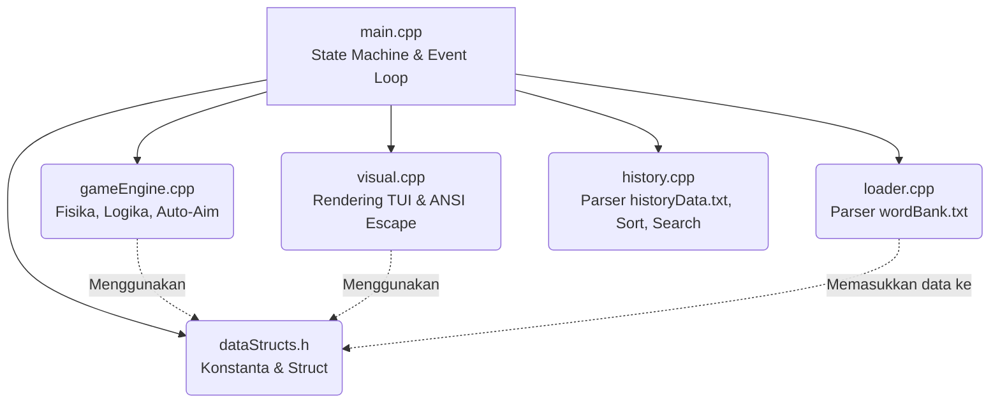
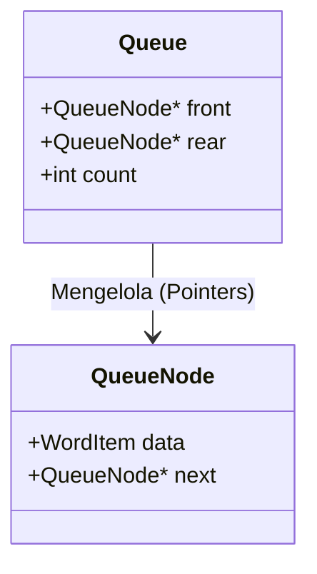
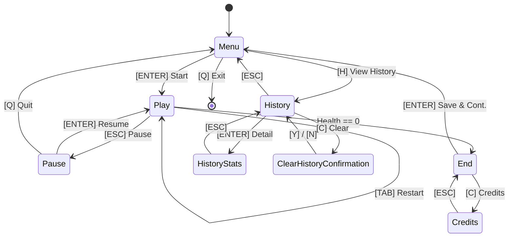
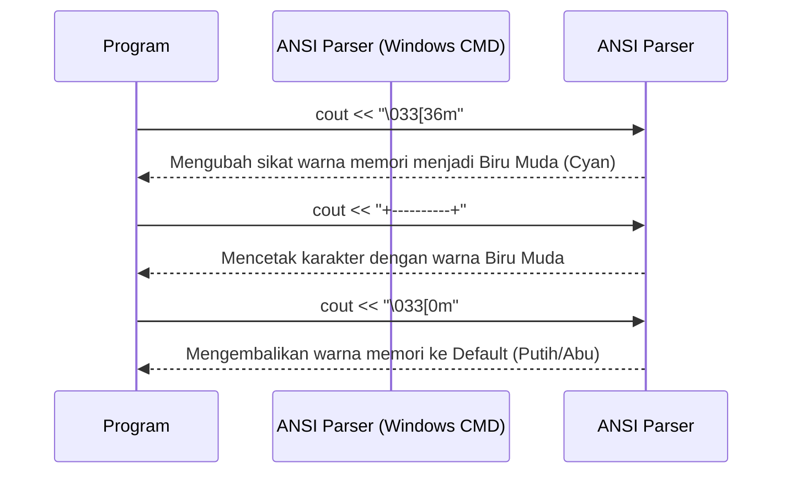

# Dokumentasi Lengkap & Analisis Mendalam Source Code "TemiTik"

Dokumen ini merupakan panduan komprehensif yang membedah arsitektur, algoritma, serta struktur data yang digunakan dalam proyek TemiTik. Dokumen ini dirancang sebagai acuan mutlak untuk memahami logika kode yang rumit dan sangat cocok digunakan saat presentasi atau sidang di hadapan dosen penguji.

Proyek ini telah secara mutlak memenuhi prinsip **Separation of Concerns (SoC)**, **Clean Code**, dan telah **bebas dari Magic Numbers**.

---

## 1. Arsitektur Perangkat Lunak & Diagram Modul

TemiTik dibagi menjadi beberapa modul independen di mana masing-masing modul mengemban **satu tanggung jawab spesifik** (Separation of Concerns).



- **`dataStructs.h`**: Sebagai pusat struktur data, enum, dan **sumber tunggal kebenaran (Single Source of Truth)** untuk konstanta permainan (waktu, kecepatan, warna, batas).
- **`main.cpp`**: Mengatur lalu lintas antar layar menggunakan sistem State Machine.
- **`visual.cpp`**: Bertanggung jawab penuh atas manipulasi konsol terminal dan pewarnaan (tanpa *library* GUI eksternal).
- **`gameEngine.cpp`**: Otak dari *gameplay*, tempat terjadinya penghitungan kecepatan jatuh, tabrakan (*collision*), dan kalkulasi peluru meriam.
- **`loader.cpp`**: Secara spesifik hanya memuat daftar kata mentah ke dalam memori.
- **`history.cpp`**: Secara eksklusif mengelola rekaman skor pemain, dari pembacaan *file*, pengurutan (*Sorting*), hingga pencarian (*Searching*).

---

## 2. Struktur Data Inti (Implementasi Manual)

### A. Queue Berbasis Linked List
TemiTik menggunakan alokasi memori dinamis (Heap) untuk memuat ribuan baris teks kata secara aman tanpa *buffer overflow* atau keterbatasan *array* statis. Implementasinya dilakukan murni secara manual tanpa `<queue>`.



**Cuplikan Implementasi (`loader.cpp`):**
Setiap baris yang terbaca di-*Enqueue* melalui pointer dengan menghubungkan ekor (*rear*) ke elemen baru.
```cpp
QueueNode* newNode = new QueueNode;
newNode->data.text = rawText;
newNode->next = nullptr;

if (q->rear == nullptr) {
    q->front = newNode;
    q->rear = newNode;
} else {
    q->rear->next = newNode;
    q->rear = newNode;
}
q->count++;
```

### B. Representasi Tipe Bentukan Lain (`dataStructs.h`)
- **`WordItem`**: Menyimpan teks, koordinat sumbu X (horizontal), koordinat sumbu Y (vertikal), dan status keaktifannya.
- **`PlayerState`**: Menyimpan jumlah *Health* terkini, Skor, kecepatan level, dan *string input* (kata yang sedang diketik pemain).
- **`ScoreRecord`**: Menyimpan data skor mutlak dan durasi bermain (*playTimeInSeconds*) untuk keperluan penyortiran data.

---

## 3. Siklus State Machine (`main.cpp`)

Lalu lintas interaksi dalam aplikasi diatur menggunakan `switch-case` di dalam sebuah *game loop* utama yang tidak memblokir (asinkron).



### Input Asinkron Dinamis
Berbeda dengan `cin` yang membekukan program, TemiTik menangkap ketikan *keyboard* sekaligus memantau perubahan ukuran layar (resize) tanpa lag:
```cpp
int getAsyncInputOrResize(int& currentWidth, int& currentHeight) {
    while (true) {
        if (_kbhit()) return _getch(); // Tangkap tombol secara langsung
        
        int checkWidth, checkHeight;
        getTerminalSize(checkWidth, checkHeight);
        if (checkWidth != currentWidth || checkHeight != currentHeight) {
            return 0; // Kembalikan sinyal untuk memicu 'render ulang' karena layar di-resize
        }
        Sleep(ASYNC_INPUT_SLEEP_MS);
    }
}
```

---

## 4. Mekanisme Parsing I/O Manual

### Parsing Riwayat Tahan Banting (`history.cpp`)
Karena `fileStream >> int` tidak stabil (langsung *crash* jika tak sengaja membaca teks komentar `//`), TemiTik menggunakan ekstraksi *substring* berbasis spasi.

```cpp
while (count < MAX_HISTORY_RECORDS && getline(fileStream, line)) {
    // Lewati komentar file dan baris kosong
    if (line.empty() || line.substr(0, 2) == "//") continue;
    
    // Pecah string menjadi 2 integer berdasarkan posisi spasi
    size_t spacePos = line.find(' ');
    if (spacePos != string::npos) {
        records[count].score = stoi(line.substr(0, spacePos));
        records[count].playTimeInSeconds = stoi(line.substr(spacePos + 1));
        count++;
    }
}
```

---

## 5. Jantung Permainan: `gameEngine.cpp`

### A. Animasi & Deteksi Batas (Hitbox Physics)
Jarak batas tanah di-*hardcode* di masa lalu, yang menyebabkan kehancuran UI saat layar berubah. Sekarang permainan mengimplementasikan konstanta offset mutlak:
```cpp
const int BORDER_BOTTOM_MARGIN = 5;
const int TURRET_HEIGHT_OFFSET = 7;
const int TURRET_BASE_OFFSET = 5;
```

**Kondisi Nabrak Tanah:**
```cpp
if (activeWords[i].yPosition >= currentTermHeight - BORDER_BOTTOM_MARGIN) {
    activeWords[i].isActive = false; // Membunuh objek
    playerState->currentHealth--;    // Mengurangi nyawa
}
```

### B. Kecerdasan Penentuan Target (Threat-Priority Auto-Aim)
Program memprioritaskan kata yang letaknya **Paling Mendekati Tanah (Y terbesar)** saat pemain mulai mengetik awalan huruf yang sama dengan banyak kata.

```cpp
int bestTarget = -1;
int maxY = -1;

for (int i = 0; i < MAX_ACTIVE_WORDS; i++) {
    // Validasi: Apakah inputan pengguna merupakan awalan dari kata ini?
    if (activeWords[i].isActive && activeWords[i].text.find(playerState->currentInput) == 0) {
        // Cek ancaman gravitasi (Semakin ke bawah = Y makin besar)
        if (activeWords[i].yPosition > maxY) {
            maxY = activeWords[i].yPosition;
            bestTarget = i; // Ini adalah target mutlak
        }
    }
}
if (bestTarget != -1) targetWordIndex = bestTarget;
```

---

## 6. Algoritma Sorting & Searching Wajib (`history.cpp`)

Sebagai syarat kelulusan Struktur Data, *library* abstrak `<algorithm>` tidak disentuh sama sekali.

### A. Bubble Sort Klasik O(n^2)
Proses pemindahan elemen array ke atas/bawah secara perlahan melalui pertukaran posisi berdekatan:

```cpp
void sortRecordsDescending(ScoreRecord* records, int count) {
    for (int i = 0; i < count - 1; i++) {
        for (int j = 0; j < count - i - 1; j++) {
            // Urutkan turun (Dari nilai paling tinggi)
            if (records[j].score < records[j + 1].score) { 
                ScoreRecord temp = records[j];
                records[j] = records[j + 1];
                records[j + 1] = temp;
            }
        }
    }
}
```

### B. Pencarian Numerik Dua Tahap dengan Partial Match
Fitur pencarian **hanya menerima input angka (0–9)** sesuai spesifikasi [[PRD#f. Searching|PRD]]. Lihat dokumen detail di [[HistorySearch]].

Algoritma bekerja dalam dua tahap:
1. **Binary Search** menemukan nilai eksak pada kolom *Score* di array yang sudah di-sort.
2. **Sequential Partial Match** menelusuri seluruh data, mencocokkan digit *query* sebagai substring di kolom *Score* maupun *Time* secara manual tanpa menggunakan `string::find`.

```cpp
// Pencocokan substring manual pada kolom skor
if (scoreStr.length() >= query.length()) {
    for (int j = 0; j <= (int)(scoreStr.length() - query.length()); j++) {
        bool match = true;
        for (int k = 0; k < (int)query.length(); k++) {
            if (scoreStr[j + k] != query[k]) { match = false; break; }
        }
        if (match) { foundInScore = true; break; }
    }
}
```

Edge case yang ditangani: query kosong → seluruh data dikembalikan; query non-numerik → 0 hasil; reset halaman otomatis saat query berubah.

---

## 7. Penanganan Grafis TUI ANSI (`visual.cpp`)

Tidak ada fungsi eksternal sistem GUI. Program mencetak karakter *escape* khusus untuk mengatur warna piksel terminal.



**Penghapusan Antarmuka Tanpa Data:**
Pada tabel Riwayat, jika `count == 0` (misalnya saat mencari dengan *keyword* yang salah), program melukis "spasi" kosong menimpa garis pembatas tengah agar tidak bertabrakan dengan pesan *"No history available"*:
```cpp
if (count > 0) {
    // Lukis pembatas vertikal tabel kuning
    setColor(COLOR_YELLOW);
    for(int y = HISTORY_DATA_START_Y; y < terminalHeight - 3; y++) {
        moveCursorTo(terminalWidth / 2, y); cout << "|";
    }
    resetColor();
} else {
    // Timpa bekas garis pembatas sebelumnya dengan kekosongan
    for(int y = HISTORY_DATA_START_Y; y < terminalHeight - 3; y++) {
        moveCursorTo(terminalWidth / 2, y); cout << " "; 
    }
}
```

---
*Dokumen ini dirancang untuk menunjukkan bahwa seluruh kode telah ditulis, dioptimasi, dan dianalisis mendalam dengan tangan untuk memenuhi standar mutu pemprograman yang efisien dan disiplin.*
