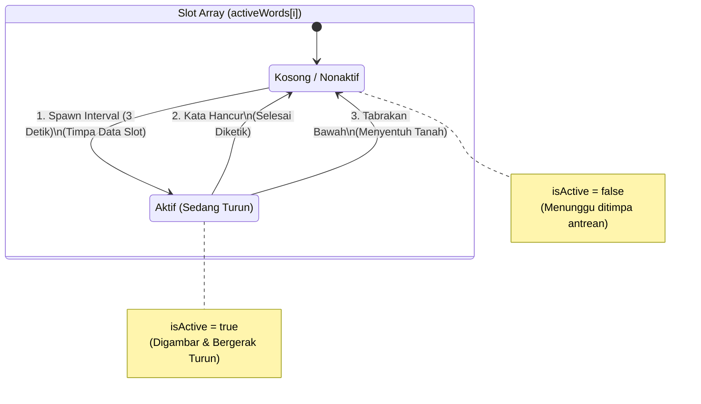
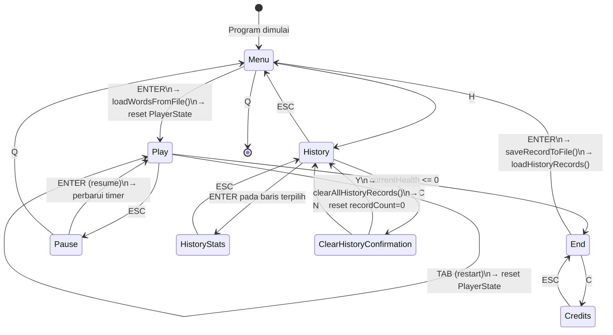
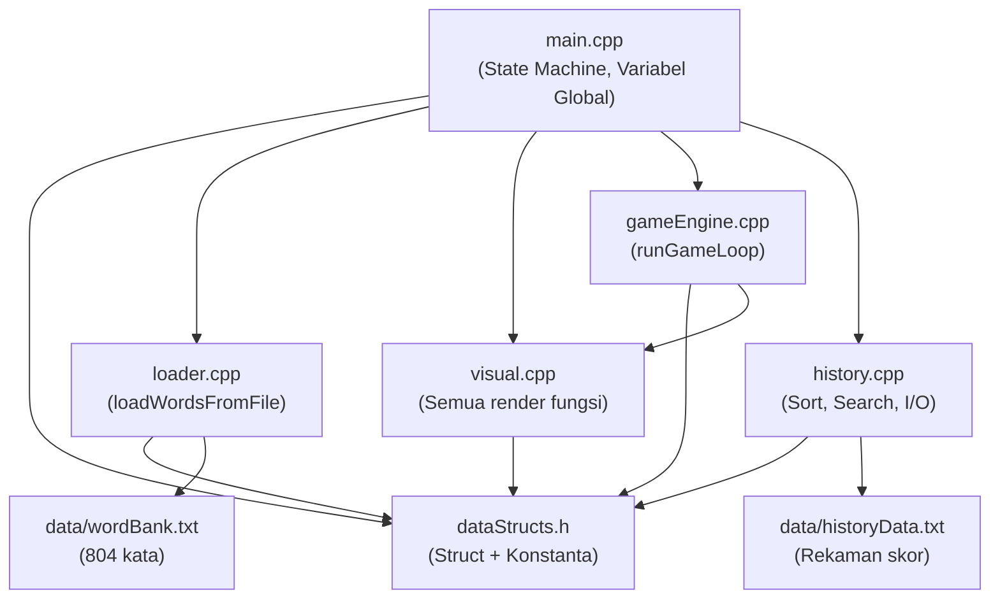

# Mekanisme Aplikasi TemiTik — Panduan Teknis Mendalam

> **Tujuan Dokumen**: Menjelaskan secara sangat detail dan akurat bagaimana setiap komponen aplikasi bekerja, dari mana data berasal, ke mana data pergi, struktur apa yang digunakan, fungsi mana yang memanggilnya, dan bagaimana alur eksekusinya — semua berdasarkan kode nyata.

---

## Daftar Isi

1. [[Mekanisme_Aplikasi#1-titik-masuk-program-maincpp|Titik Masuk Program (main.cpp)]]
2. [[Mekanisme_Aplikasi#2-sistem-pemuatan-kata-loader--wordbanktxt--queue|Sistem Pemuatan Kata: Loader → wordBank.txt → Queue]]
3. [[Mekanisme_Aplikasi#3-struktur-data-inti-datastrutsh|Struktur Data Inti (dataStructs.h)]]
4. [[Mekanisme_Aplikasi#4-mesin-permainan-gameenginecpp--alur-gameplay|Mesin Permainan (gameEngine.cpp) — Alur Gameplay]]
5. [[Mekanisme_Aplikasi#5-sistem-rendering-visualcpp|Sistem Rendering (visual.cpp)]]
6. [[Mekanisme_Aplikasi#6-sistem-riwayat-historycpp--historydata-txt|Sistem Riwayat (history.cpp) — historyData.txt]]
7. [[Mekanisme_Aplikasi#7-state-machine-navigasi-layar|State Machine — Navigasi Layar]]
8. [[Mekanisme_Aplikasi#8-alur-data-end-to-end-lengkap|Alur Data End-to-End Lengkap]]

---

## 1. Titik Masuk Program (`main.cpp`)

### 1.1 Inisialisasi Global

Saat program dijalankan, `int main()` di [[src/main.cpp]] adalah fungsi pertama yang berjalan. Urutan inisialisasinya:

```cpp
// main.cpp, baris 71
initTerminal();           // → visual.cpp: Aktifkan ANSI, sembunyikan kursor
GameState currentState = Menu;           // State awal = Menu
PlayerState playerState = {"", STARTING_HEALTH, 0, INITIAL_DROP_SPEED};
//                           ↑input  ↑3 nyawa   ↑skor 0  ↑kecepatan 1

ScoreRecord historyRecords[MAX_HISTORY_RECORDS]; // Array 100 slot, di stack
int recordCount = loadHistoryRecords(historyRecords); // Baca historyData.txt

ScoreRecord filteredRecords[MAX_HISTORY_RECORDS];    // Array 100 slot, untuk filter
int filteredCount = recordCount;

HistoryState historyState = {"", 0, 0, -1, true, false};
//                           ↑query ↑kursor ↑halaman ↑searchIdx ↑ASC ↑searchOff

Queue wordQueue;                // Struct Queue kosong, di stack
wordQueue.front = nullptr;      // Belum ada node
wordQueue.rear  = nullptr;
wordQueue.count = 0;
```

**Semua variabel ini hidup di stack `main()` dan diteruskan via pointer ke modul lain.** Tidak ada variabel global yang tersembunyi.

### 1.2 Game Loop Utama

```
while (isRunning) {
    ┌─ Cek resize terminal ─────────────────────────────────────────┐
    │  getTerminalSize() → bandingkan dengan ukuran sebelumnya       │
    │  Jika berbeda → set terminalResized = true                     │
    └────────────────────────────────────────────────────────────────┘

    stateChanged = (currentState != previousState) || terminalResized

    switch (currentState) {
        case Menu:     → render + tangkap input → ubah state
        case Play:     → panggil runGameLoop() → blocking
        case End:      → render + tangkap input → simpan skor
        case History:  → sort + filter + render + tangkap input
        case HistoryStats: → render 1 record detail
        case Credits:  → render credits
        case ClearHistoryConfirmation: → render konfirmasi + hapus
    }
}
```

---

## 2. Sistem Pemuatan Kata: Loader → `wordBank.txt` → Queue

Ini adalah alur paling fundamental dalam permainan. Saat pemain menekan **ENTER** di Menu Utama:

### 2.1 Trigger di `main.cpp`

```cpp
// main.cpp, baris 150
loadWordsFromFile("data/wordBank.txt", &wordQueue);
```

Fungsi `loadWordsFromFile` dideklarasikan di [[include/loader.h]] dan diimplementasikan di [[src/loader.cpp]].

### 2.2 Isi `data/wordBank.txt`

File ini berisi **805 baris** (804 kata + 1 baris kosong), satu kata per baris:
```
sebagai      ← baris 1 → akan menjadi node pertama di Queue (front)
saya         ← baris 2
nya          ← baris 3
bahwa        ← baris 4
...
hidung       ← baris 800
...          ← dan seterusnya
```

Format: teks mentah UTF-8 (ada BOM `0xEF 0xBB 0xBF` di awal file yang harus dibersihkan).

### 2.3 Fungsi `loadWordsFromFile` — Langkah per Langkah

```cpp
// loader.cpp, baris 57-101
bool loadWordsFromFile(string filePath, Queue* targetQueue) {
```

**Langkah 1 — Reset Queue:**
```cpp
targetQueue->front = nullptr;   // Hapus pointer front
targetQueue->rear  = nullptr;   // Hapus pointer rear
targetQueue->count = 0;         // Reset counter
```
Queue dikosongkan terlebih dahulu karena fungsi ini dipanggil setiap kali sesi baru dimulai.

**Langkah 2 — Buka File dengan Fallback:**
```cpp
ifstream fileStream("data/wordBank.txt");
if (!fileStream.is_open()) {
    fileStream.open("../data/wordBank.txt");   // Fallback 1 level atas
    if (!fileStream.is_open()) {
        fileStream.open("../../data/wordBank.txt"); // Fallback 2 level atas
        if (!fileStream.is_open()) return false;    // Gagal total
    }
}
```
Tiga fallback dibutuhkan karena eksekutable bisa dijalankan dari `build/`, `build/Debug/`, atau langsung dari root.

**Langkah 3 — Baca Baris per Baris:**
```cpp
string currentLine;
bool isFirstLine = true;

while (getline(fileStream, currentLine)) {
    if (isFirstLine) {
        // Deteksi dan buang UTF-8 BOM (0xEF 0xBB 0xBF)
        if (currentLine.size() >= 3 &&
            (unsigned char)currentLine[0] == 0xEF &&
            (unsigned char)currentLine[1] == 0xBB &&
            (unsigned char)currentLine[2] == 0xBF) {
            currentLine = currentLine.substr(3); // Potong 3 byte BOM
        }
        isFirstLine = false;
    }

    if (!currentLine.empty()) {
        enqueueWord(targetQueue, currentLine); // Masukkan ke Queue
    }
}
```

**Langkah 4 — `enqueueWord` (fungsi static di loader.cpp):**

```cpp
// loader.cpp, baris 29-55
static void enqueueWord(Queue* q, const string& rawText) {
    // Bersihkan carriage return Windows (\r) jika ada
    string text = rawText;
    if (!text.empty() && text.back() == '\r') {
        text.pop_back();  // Hapus \r dari akhir string
    }

    // ALOKASI HEAP: Buat node baru di memori dinamis
    QueueNode* newNode = new QueueNode;

    // Isi data node
    newNode->data.text      = text; // "sebagai", "saya", dll
    newNode->data.xPosition = 0;    // Posisi X belum ditentukan
    newNode->data.yPosition = 0;    // Posisi Y belum ditentukan
    newNode->data.isActive  = false;// Belum aktif
    newNode->next = nullptr;        // Ini akan menjadi ekor

    // Sambungkan ke Queue
    if (q->rear == nullptr) {       // Queue kosong: node ini jadi front DAN rear
        q->front = newNode;
        q->rear  = newNode;
    } else {                        // Queue sudah ada isi: sambungkan di belakang rear
        q->rear->next = newNode;    // rear lama menunjuk ke node baru
        q->rear       = newNode;    // rear sekarang adalah node baru
    }

    q->count++;  // Tambah counter
}
```

### 2.4 Visualisasi Queue Setelah Load

Setelah `loadWordsFromFile` selesai, memori di heap terlihat seperti ini:

```
Stack (main.cpp):
┌─────────────────────────────────────────────────────┐
│  Queue wordQueue                                     │
│  ┌──────────────────┐                               │
│  │ front ──────────►│──┐                            │
│  │ rear  ──────────►│  │ (menunjuk ke node terakhir)│
│  │ count = 804      │  │                            │
│  └──────────────────┘  │                            │
└────────────────────────│────────────────────────────┘
                         │
Heap (memori dinamis):   │
                         ▼
┌─────────────────────────────────────────────────────────────────────┐
│  QueueNode #1 (front)     QueueNode #2            QueueNode #804    │
│  ┌──────────────┐         ┌──────────────┐         ┌────────────┐   │
│  │ data:        │         │ data:        │         │ data:      │   │
│  │  text="sebagai"│        │  text="saya" │ ···     │  text="hidung"│ │
│  │  xPos=0      │  next►  │  xPos=0      │         │  xPos=0    │   │
│  │  yPos=0      │─────►  │  yPos=0      │─────►   │  yPos=0    │   │
│  │  isActive=F  │         │  isActive=F  │         │  isActive=F│   │
│  │ next         │         │ next         │         │ next=NULL  │◄──┤rear
│  └──────────────┘         └──────────────┘         └────────────┘   │
└─────────────────────────────────────────────────────────────────────┘
```

**Prinsip FIFO (First In, First Out):** Kata "sebagai" (baris pertama) akan menjadi kata pertama yang keluar dari Queue dan muncul pertama di layar.

---

## 3. Struktur Data Inti (`dataStructs.h`)

Semua struct dan enum didefinisikan di [[include/dataStructs.h]] sebagai **Single Source of Truth**.

### 3.1 Enum `GameState`

```cpp
// dataStructs.h, baris 57-66
enum GameState {
    Menu = 0,                    // Layar menu utama
    Play = 1,                    // Sesi permainan aktif
    End  = 2,                    // Layar Game Over
    History = 3,                 // Tabel riwayat skor
    HistoryStats = 4,            // Detail 1 rekaman
    Credits = 5,                 // Layar kredit tim
    ClearHistoryConfirmation = 6,// Dialog konfirmasi hapus
    Pause = 7                    // Overlay jeda permainan
};
```

`GameState` disimpan dalam variabel `currentState` di `main.cpp` dan menentukan `case` mana yang aktif di `switch`.

### 3.2 Struct `WordItem`

```cpp
// dataStructs.h, baris 73-78
struct WordItem {
    std::string text;  // Teks kata, misal "sebagai" — ukuran besar, di heap
    int xPosition;     // Kolom terminal (1-indexed) tempat kata digambar
    int yPosition;     // Baris terminal (1-indexed) tempat kata digambar
    bool isActive;     // true = sedang jatuh di layar, false = sudah mati/tidak dipakai
};
```

**Kapan digunakan:**
- Saat di Queue: `text` terisi, `xPos=0`, `yPos=0`, `isActive=false`
- Saat di-dequeue ke `activeWords[]`: `xPos` diisi random, `yPos=2`, `isActive=true`
- Saat berhasil diketik/menyentuh bawah: `isActive=false`

### 3.3 Struct `QueueNode`

```cpp
// dataStructs.h, baris 105-108
struct QueueNode {
    QueueNode* next;  // Pointer ke node berikutnya (8 byte di 64-bit)
    WordItem data;    // Data kata yang disimpan (ukuran besar)
};
```

`next` diletakkan **sebelum** `data` karena pointer (8 byte) lebih besar dari beberapa tipe dalam `WordItem`, mengikuti prinsip **struct packing** untuk efisiensi memori.

### 3.4 Struct `Queue`

```cpp
// dataStructs.h, baris 117-121
struct Queue {
    QueueNode* front;  // Pointer ke node terdepan (dequeue dari sini)
    QueueNode* rear;   // Pointer ke node paling belakang (enqueue ke sini)
    int count;         // Jumlah node saat ini
};
```

**Operasi Queue:**
- **Enqueue** (tambah di belakang): `rear->next = newNode; rear = newNode;`
- **Dequeue** (ambil dari depan): `temp = front; front = front->next; delete temp;`

### 3.5 Struct `PlayerState`

```cpp
// dataStructs.h, baris 91-96
struct PlayerState {
    std::string currentInput; // Teks yang sedang diketik pemain (misal "seb")
    int currentHealth;        // Sisa nyawa (awal: STARTING_HEALTH = 3)
    int currentScore;         // Skor terkini (bertambah POINTS_PER_WORD = 10 per kata)
    int levelSpeed;           // Kecepatan jatuh kata (awal: INITIAL_DROP_SPEED = 1)
};
```

Variabel ini hidup di stack `main()` dan **diteruskan via pointer** ke `runGameLoop()` dan `renderGameUI()`.

### 3.6 Struct `ScoreRecord`

```cpp
// dataStructs.h, baris 83-86
struct ScoreRecord {
    int score;             // Skor akhir sesi (misal: 150 poin)
    int playTimeInSeconds; // Durasi bermain dalam detik (misal: 187 detik = 3m 7s)
};
```

**Tempat tinggal:**
- `historyRecords[100]` di stack `main()`: semua rekaman dari file
- `filteredRecords[100]` di stack `main()`: subset setelah filter pencarian

### 3.7 Struct `HistoryState`

```cpp
// dataStructs.h, baris 130-137
struct HistoryState {
    std::string searchQuery; // Query pencarian numerik (misal: "15")
    int cursorIndex;         // Indeks baris yang disorot kursor ">>"
    int currentPage;         // Halaman yang sedang ditampilkan (0-indexed)
    int searchResultIndex;   // Indeks hasil Binary Search (-1 jika tidak ada)
    bool isAscending;        // true = urut ASC, false = urut DESC
    bool isSearchActive;     // true = mode mengetik query aktif
};
```

### 3.8 Konstanta Global

```cpp
// dataStructs.h, baris 17-51 (sebagian)
constexpr int STARTING_HEALTH        = 3;     // Nyawa awal pemain
constexpr int POINTS_PER_WORD        = 10;    // Poin per kata berhasil
constexpr int MAX_ACTIVE_WORDS       = 5;     // Maksimum kata serentak di layar
constexpr int WORD_BANK_CAPACITY     = 1000;  // Kapasitas max wordBank (referensi)
constexpr int MAX_HISTORY_RECORDS    = 100;   // Kapasitas max riwayat
constexpr int MAX_RECORDS_PER_PAGE   = 5;     // Rekaman per halaman di History
constexpr int WORD_SPAWN_INTERVAL_MS = 3000;  // Jeda antar kemunculan kata (3 detik)
constexpr int SCORE_DIVISOR_FOR_SPEED= 50;    // Setiap 50 poin → kecepatan +1
constexpr int INITIAL_DROP_SPEED     = 1;     // Kecepatan awal
constexpr int MAX_SPAWN_ATTEMPTS     = 10;    // Percobaan max cari posisi X aman
```

---

## 4. Mesin Permainan (`gameEngine.cpp`) — Alur Gameplay

### 4.1 Inisialisasi di `runGameLoop`

Saat `main.cpp` memanggil `runGameLoop(&playerState, currentState, &wordQueue)`:

```cpp
// gameEngine.cpp, baris 45-56
void runGameLoop(PlayerState* playerState, GameState& currentState, Queue* wordQueue) {
    // Array kata aktif, di stack frame runGameLoop
    WordItem activeWords[MAX_ACTIVE_WORDS]; // 5 slot WordItem
    for (int i = 0; i < MAX_ACTIVE_WORDS; i++) {
        activeWords[i].isActive = false;    // Semua slot kosong awalnya
    }

    srand((unsigned)time(0)); // Seed random untuk posisi X kata

    // Set timer agar kata pertama langsung muncul
    ULONGLONG lastDropTime = GetTickCount64() - WORD_SPAWN_INTERVAL_MS;
    ULONGLONG lastMoveTime = GetTickCount64();

    int lastTurretX = -1; // Posisi turret sebelumnya
```

### 4.2 Mekanisme Dequeue: Dari Queue ke `activeWords[]`

Ini adalah inti dari gameplay. Setiap `WORD_SPAWN_INTERVAL_MS` (3 detik), program mencoba mengambil kata dari Queue:

```
┌─── Cek apakah sudah waktunya spawn (setiap 3 detik) ───────────────┐
│                                                                      │
│  Cari slot kosong (isActive=false) di activeWords[0..4]             │
│  ↓ ditemukan (misal index 2)                                        │
│                                                                      │
│  Peek Queue: baca wordQueue->front->data.text tanpa dequeue         │
│  Hitung maxPosX = terminalWidth - panjang_kata - (BORDER_LEFT*2)   │
│                                                                      │
│  Loop MAX_SPAWN_ATTEMPTS (10x) untuk cari posisi X yang tidak nabrak│
│  ↓ posisi aman ditemukan                                            │
│                                                                      │
│  DEQUEUE MANUAL:                                                     │
│    QueueNode* temp = wordQueue->front;                               │
│    activeWords[2]  = temp->data;       // Salin WordItem dari node  │
│    wordQueue->front = wordQueue->front->next; // Geser front        │
│    if (front == nullptr) rear = nullptr;      // Queue jadi kosong  │
│    wordQueue->count--;                                               │
│    delete temp;                        // Bebaskan heap node        │
│                                                                      │
│  Set posisi kata yang baru di-dequeue:                              │
│    activeWords[2].isActive  = true;                                  │
│    activeWords[2].yPosition = BORDER_TOP_MARGIN; // = 2 (atas)     │
│    activeWords[2].xPosition = newX;   // Posisi X acak yang aman   │
└──────────────────────────────────────────────────────────────────────┘
```

**Kode aktual (gameEngine.cpp, baris 282-292):**
```cpp
QueueNode* temp = wordQueue->front;
activeWords[freeSlot] = temp->data;          // Salin data WordItem

wordQueue->front = wordQueue->front->next;   // Majukan pointer front
if (wordQueue->front == nullptr)             // Jika Queue sekarang kosong
    wordQueue->rear = nullptr;               // Rear juga harus null
wordQueue->count--;
delete temp;                                 // Bebaskan memori node

activeWords[freeSlot].isActive  = true;
activeWords[freeSlot].yPosition = BORDER_TOP_MARGIN; // Mulai dari atas (baris 2)
activeWords[freeSlot].xPosition = newX;
```

### 4.3 Siklus Hidup & Visualisasi Transfer Queue → activeWords

Permainan ini menggunakan dua struktur data berbeda untuk mengelola siklus hidup kata:
1.  **`Queue wordQueue`**: Menyimpan semua kata yang belum muncul (berada di antrean). Nilai `isActive` secara bawaan adalah `false`.
2.  **`WordItem activeWords[5]`**: Sebuah *array* statis berkapasitas 5 slot untuk kata-kata yang sedang ditayangkan di layar. 

Status `isActive` pada *array* ini bertindak sebagai **sakelar hidup/mati** sekaligus penanda **apakah slot tersebut kosong atau terisi**.

#### Diagram Siklus Hidup Kata (Mermaid)



#### Visualisasi Memori Saat Transfer Berlangsung

```text
Queue (Heap) — sebelum dequeue:
┌─────────────────────────────────────────────────────────────┐
│ front ──► [Node:"sebagai"|next──►] [Node:"saya"|next──►] ... │
│ rear  ──► [Node:...|next=null]                               │
│ count = 802                                                   │
└─────────────────────────────────────────────────────────────┘
           ↓ setelah dequeue (kata "sebagai" diambil)
┌─────────────────────────────────────────────────────────────┐
│ front ──► [Node:"saya"|next──►] ...                          │
│ rear  ──► [Node:...|next=null]                               │
│ count = 801                                                   │
└─────────────────────────────────────────────────────────────┘

activeWords[] (Stack, di dalam runGameLoop):
┌───────────────────────────────────────────────────────────┐
│ [0] isActive=false  (slot kosong / bekas kata yang hancur) │
│ [1] isActive=false  (slot kosong / bekas kata yang hancur) │
│ [2] text="sebagai", xPos=23, yPos=2, isActive=true  ◄─────┤ kata baru ditimpa!
│ [3] isActive=false  (slot kosong)                          │
│ [4] isActive=false  (slot kosong)                          │
└───────────────────────────────────────────────────────────┘
```

### 4.4 Fisika: Kata Jatuh (`calculateWordDrop`)

Fungsi ini sangat sederhana — hanya menambah Y sebesar 1:

```cpp
// gameEngine.cpp, baris 32-36
void calculateWordDrop(WordItem* word) {
    if (word->isActive) {
        word->yPosition++;  // Turun 1 baris setiap dipanggil
    }
}
```

**Kapan dipanggil:** Setiap `moveInterval` milidetik, yang dihitung sebagai:
```cpp
ULONGLONG moveInterval = MS_PER_SECOND / playerState->levelSpeed;
// levelSpeed=1 → interval=1000ms (turun 1 baris/detik)
// levelSpeed=2 → interval=500ms  (turun 2 baris/detik)
// levelSpeed=5 → interval=200ms  (turun 5 baris/detik)
if (moveInterval < MIN_DROP_INTERVAL_MS) moveInterval = MIN_DROP_INTERVAL_MS; // Min 100ms
```

### 4.5 Deteksi Tabrakan dengan Batas Bawah

```cpp
// gameEngine.cpp, baris 133-156
if (activeWords[i].yPosition >= currentTermHeight - BORDER_BOTTOM_MARGIN) {
    // Kata menyentuh garis batas bawah (5 baris dari bawah terminal)
    activeWords[i].isActive = false;     // Matikan kata
    playerState->currentHealth--;        // Kurangi nyawa
    
    if (i == targetWordIndex) {          // Jika kata ini adalah target ketikan
        targetWordIndex = -1;            // Bebaskan target
        playerState->currentInput = "";  // Hapus input
    }
    
    if (playerState->currentHealth <= 0) {
        currentState = End;              // Game Over!
    }
}
```

### 4.6 Sistem Input Keyboard & Auto-Aim

Saat pemain mengetik huruf, logika **Auto-Aim** menentukan target secara otomatis:

```cpp
// gameEngine.cpp, baris 404-426
} else if (isalnum(ch) || ispunct(ch) || ch == ' ') {
    playerState->currentInput += (char)ch;  // Tambah karakter ke input

    // === AUTO-AIM: Cari ancaman terbesar (Y terbesar = paling dekat tanah) ===
    int bestTarget = -1;
    int maxY = -1;

    for (int i = 0; i < MAX_ACTIVE_WORDS; i++) {
        if (activeWords[i].isActive &&
            activeWords[i].text.find(playerState->currentInput) == 0) {
            // Kata ini dimulai dengan input pemain (prefix match)
            if (activeWords[i].yPosition > maxY) {
                maxY = activeWords[i].yPosition;
                bestTarget = i;   // Prioritaskan yang paling bawah
            }
        }
    }
    if (bestTarget != -1) targetWordIndex = bestTarget;
```

**Contoh:** Jika ada kata "saya" (Y=15) dan "sebagai" (Y=8), dan pemain mengetik "s":
- Keduanya cocok dengan prefix "s"
- "saya" di Y=15 lebih berbahaya (lebih dekat ke bawah)
- `targetWordIndex` → index kata "saya"

### 4.7 Validasi dan Penyelesaian Kata

```cpp
// gameEngine.cpp, baris 429-461
// Cek apakah input sudah sama persis dengan teks kata target
if (targetWordIndex != -1 &&
    playerState->currentInput == activeWords[targetWordIndex].text) {

    // === ANIMASI LASER ===
    int targetX = activeWords[targetWordIndex].xPosition + (text.length() / 2);
    setColor(36); // Cyan
    for (int y = startY; y > endY; y--) {
        moveCursorTo(targetX, y);
        cout << "|";              // Gambar jalur laser ke atas
    }
    Sleep(LASER_ANIMATION_DELAY_MS); // Jeda 30ms — efek kilat
    // Hapus jalur laser
    for (int y = startY; y > endY; y--) {
        moveCursorTo(targetX, y); cout << " ";
    }

    // === HASIL ===
    activeWords[targetWordIndex].isActive = false;              // Kata dihapus
    playerState->currentScore += POINTS_PER_WORD;              // +10 poin

    // Hitung kecepatan baru: kecepatan naik setiap 50 poin
    playerState->levelSpeed = INITIAL_DROP_SPEED +
        (playerState->currentScore / SCORE_DIVISOR_FOR_SPEED);

    playerState->currentInput = "";   // Kosongkan input
    targetWordIndex = -1;             // Bebaskan target
}
```

### 4.8 Sistem Peningkatan Kesulitan (Difficulty Scaling)

Kecepatan jatuh kata dalam permainan ini dihitung menggunakan rumus matematika dinamis yang **terhubung langsung dengan skor pemain**. Peningkatan ini terjadi secara otomatis pada saat pemain berhasil menghancurkan kata.

**1. Rumus Kenaikan Level (Pemicu)**

```cpp
// gameEngine.cpp, baris 457-458
playerState->levelSpeed = INITIAL_DROP_SPEED + (playerState->currentScore / SCORE_DIVISOR_FOR_SPEED);
```

Dengan `INITIAL_DROP_SPEED = 1` dan `SCORE_DIVISOR_FOR_SPEED = 50`, pembagian *integer* C++ (di mana sisa desimal akan diabaikan) ini secara matematis menghasilkan kurva kesulitan berikut:
- **Skor 0:** `1 + (0 / 50) = 1`. (`levelSpeed` tetap 1)
- **Skor 40:** `1 + (40 / 50) = 1`. (`levelSpeed` tetap 1)
- **Skor 50:** `1 + (50 / 50) = 2`. (`levelSpeed` naik menjadi 2)
- **Skor 100:** `1 + (100 / 50) = 3`. (`levelSpeed` naik menjadi 3)

**2. Konversi Level Menjadi Interval Waktu Fisik**

Angka `levelSpeed` hanyalah penanda tahapan struktural. Agar kata bisa bergerak secara fisik di terminal, program mengonversinya menjadi jeda *delay* dalam satuan milidetik pada inti *game loop*:

```cpp
// gameEngine.cpp, baris 117-118
ULONGLONG moveInterval = MS_PER_SECOND / (playerState->levelSpeed > 0 ? playerState->levelSpeed : 1);
if (moveInterval < MIN_DROP_INTERVAL_MS) moveInterval = MIN_DROP_INTERVAL_MS;
```

**Simulasi Penurunan Interval Waktu (`moveInterval`):**
- **Level 1 (Skor 0):** `1000 / 1 = 1000 ms`. Kata turun 1 baris setiap **1 detik**.
- **Level 2 (Skor 50):** `1000 / 2 = 500 ms`. Kata turun 1 baris setiap **0,5 detik** (Dua kali lebih cepat).
- **Level 4 (Skor 150):** `1000 / 4 = 250 ms`. Kata turun 1 baris setiap **0,25 detik**.

**Batas Maksimal Kecepatan Tak Terhingga:**
Tanpa pengaman, pemain berskor 1.000 akan memiliki `levelSpeed = 21` (1000/21 = 47ms per baris), yang secara visual mustahil diketik oleh manusia. Oleh karena itu, *safety block* `if (moveInterval < MIN_DROP_INTERVAL_MS)` menjamin bahwa kecepatan puncak mutlak tidak akan melampaui angka konstanta (yaitu **100 milidetik per baris**, atau 10 baris per detik). 

### 4.9 Pembersihan Queue Setelah Sesi (Mencegah Memory Leak)

Setelah `runGameLoop` selesai (karena game over atau keluar), `main.cpp` membersihkan sisa node di Queue:

```cpp
// main.cpp, baris 184-190
while (wordQueue.front != nullptr) {
    QueueNode* temp = wordQueue.front;
    wordQueue.front  = wordQueue.front->next;
    delete temp;                     // Bebaskan setiap node dari heap
}
wordQueue.rear  = nullptr;
wordQueue.count = 0;
```

---

## 5. Sistem Rendering (`visual.cpp`)

### 5.1 Hierarki Fungsi Rendering

```
visual.cpp menyediakan:
├── Utilitas Terminal
│   ├── initTerminal()         → Aktifkan ANSI, hideCursor()
│   ├── getTerminalSize()      → Windows API: GetConsoleScreenBufferInfo
│   ├── clearScreen()          → ANSI: \033[2J\033[3J\033[H
│   ├── moveCursorTo(x, y)    → ANSI: \033[y;xH
│   ├── hideCursor()           → ANSI: \033[?25l
│   ├── showCursor()           → ANSI: \033[?25h
│   ├── setColor(code)         → ANSI: \033[{code}m
│   └── resetColor()           → ANSI: \033[0m
│
├── Primitif Gambar
│   ├── drawBox(x,y,w,h)       → Gambar kotak ASCII dengan +, -, |
│   ├── drawHorizontalLine()   → Gambar garis -
│   └── printCentered()        → Hitung X tengah, print teks
│
└── Render Layar (dipanggil dari main.cpp)
    ├── renderMainMenu(bool)
    ├── renderGameUI(PlayerState*, bool)
    ├── renderEndScreen(score, time, bool)
    ├── renderCreditsScreen(bool)
    ├── renderHistoryMenu(records[], count, HistoryState*, bool)
    ├── renderHistoryStats(ScoreRecord*, bool)
    ├── renderClearHistoryConfirmation(bool)
    └── renderPauseScreen(bool)
```

### 5.2 Sistem Warna ANSI

```cpp
// visual.cpp, baris 58-63
constexpr int COLOR_RED     = 31; // Game Over, Clear History, health bar
constexpr int COLOR_GREEN   = 32; // Bingkai game, kata benar, kursor >>
constexpr int COLOR_YELLOW  = 33; // Indikator auto-aim, History
constexpr int COLOR_CYAN    = 36; // Menu Utama, turret, laser
constexpr int COLOR_MAGENTA = 35; // Credits, placeholder search
constexpr int COLOR_RESET   = 0;  // Kembalikan ke default
```

### 5.3 `renderGameUI` — Render HUD Permainan

Fungsi ini dipanggil sangat sering: **setiap kali ada pergerakan kata** dan **setiap kali ada input keyboard**:

```cpp
// visual.cpp, baris 344-404
void renderGameUI(PlayerState* state, bool fullRedraw) {
    int borderY = terminalHeight - GAME_BORDER_BOTTOM_Y_OFFSET; // -5 dari bawah
    int scoreY  = terminalHeight - GAME_SCORE_Y_OFFSET;         // -4 dari bawah
    int inputY  = terminalHeight - GAME_INPUT_Y_OFFSET;         // -2 dari bawah

    if (fullRedraw) {               // Hanya saat pertama kali atau resize
        clearScreen();
        drawBox(1, 1, w, h);        // Bingkai hijau
        drawHorizontalLine(2, borderY, w-2); // Garis pemisah bawah
    }

    // Health bar: "<3 <3 <3 " (tiap <3 = 1 nyawa)
    for (int i = 0; i < STARTING_HEALTH; i++) {
        if (i < state->currentHealth) cout << "<3 ";
        else cout << "   ";  // Timpa dengan spasi jika nyawa sudah hilang
    }

    // Skor + kecepatan di tengah
    "Score: 150 | Speed: 4"

    // Input pemain di bawah
    "Input: > seb"
}
```

### 5.4 `formatTime` — Konversi Detik ke Format Tampilan

```cpp
// visual.cpp, baris 48-55 (static, hanya bisa dipakai dalam visual.cpp)
static string formatTime(int totalSeconds) {
    int minutes = totalSeconds / 60;
    int seconds = totalSeconds % 60;
    if (minutes == 0) return to_string(seconds) + "s";
    return to_string(minutes) + "m " + to_string(seconds) + "s";
}
// Contoh:
// 45  → "45s"
// 187 → "3m 7s"
// 60  → "1m 0s"
```

Digunakan di: `renderEndScreen`, `renderHistoryMenu`, `renderHistoryStats`.

---

## 6. Sistem Riwayat (`history.cpp`) — `historyData.txt`

### 6.1 Format File `data/historyData.txt`

```
150 187
90 45
200 312
// komentar ini diabaikan saat dibaca
```

Format per baris: `{score} {playTimeInSeconds}\n`
- Spasi tunggal sebagai delimiter
- Baris komentar diawali `//` diabaikan
- Dibaca ulang setiap kali pemain kembali ke state History

### 6.2 `saveRecordToFile` — Simpan Skor ke File

Dipanggil dari `main.cpp` saat pemain menekan ENTER di End Screen:

```cpp
// main.cpp, baris 207-208
ScoreRecord newRecord = {playerState.currentScore, currentSessionTime};
saveRecordToFile(newRecord);
```

```cpp
// history.cpp, baris 35-51
void saveRecordToFile(ScoreRecord newRecord) {
    ofstream fileStream(HISTORY_FILE_PATH, ios::app); // Append, tidak timpa
    // ... fallback paths ...
    fileStream << newRecord.score << " " << newRecord.playTimeInSeconds << "\n";
    fileStream.close();
}
// Menulis ke file: "150 187\n"
```

### 6.3 `loadHistoryRecords` — Baca File ke Array

```cpp
// history.cpp, baris 64-103
int loadHistoryRecords(ScoreRecord* records) {
    // Buka file, baca baris per baris dengan getline
    while (count < MAX_HISTORY_RECORDS && getline(fileStream, line)) {
        if (line.empty() || line.substr(0, 2) == "//") continue; // Lewati komentar

        size_t spacePos = line.find(' ');  // Cari posisi spasi
        if (spacePos != string::npos) {
            records[count].score = stoi(line.substr(0, spacePos));           // "150"
            records[count].playTimeInSeconds = stoi(line.substr(spacePos+1)); // "187"
            count++;
        }
    }
    return count; // Jumlah rekaman yang berhasil dibaca
}
```

### 6.4 Bubble Sort — `sortRecordsAscending` dan `sortRecordsDescending`

Dipanggil **setiap frame** di state History:

```cpp
// main.cpp, baris 227-231
if (historyState.isAscending) {
    sortRecordsAscending(historyRecords, recordCount);
} else {
    sortRecordsDescending(historyRecords, recordCount);
}
```

**Implementasi Ascending (history.cpp, baris 138-154):**
```
Pass 1: [200, 150, 90] → swap(200,150) → [150, 200, 90] → swap(200,90) → [150, 90, 200]
Pass 2: [150, 90, 200] → swap(150,90)  → [90, 150, 200]
Hasil:  [90, 150, 200] ✓

Kompleksitas: O(n²) — dua nested loop
Inner loop: j dari 0 hingga count-i-2 (jangkauan menyusut per pass)
```

```cpp
void sortRecordsAscending(ScoreRecord* records, int count) {
    for (int i = 0; i < count - 1; i++) {
        for (int j = 0; j < count - i - 1; j++) {
            if (records[j].score > records[j + 1].score) {  // Jika kiri > kanan
                ScoreRecord temp   = records[j];             // Swap manual (tanpa std::swap)
                records[j]         = records[j + 1];
                records[j + 1]     = temp;
            }
        }
    }
}
```

**Descending:** Identik, hanya kondisi swap dibalik menjadi `< ` (bukan `>`).

### 6.5 Filter & Pencarian: `filterHistoryRecords`

Dipanggil setiap frame setelah sort, untuk mengisi `filteredRecords[]`:

```cpp
// main.cpp, baris 237
filteredCount = filterHistoryRecords(
    historyRecords,         // Sumber (sudah diurutkan)
    recordCount,            // Jumlah sumber
    filteredRecords,        // Tujuan (hasil filter)
    historyState.searchQuery, // Query (misal "15")
    historyState.isAscending  // Arah sort (mempengaruhi Binary Search)
);
```

**Algoritma 2 Tahap:**

**Tahap 1 — Binary Search (Eksak pada kolom score):**
```cpp
int left = 0, right = sourceCount - 1;
int foundIndex = -1;

while (left <= right) {
    int mid = left + (right - left) / 2; // Aman dari overflow
    if (source[mid].score == exactTarget) {
        foundIndex = mid; break;
    }
    if (isAscending) {
        if (source[mid].score < exactTarget) left = mid + 1;
        else right = mid - 1;
    } else {
        // Array terbalik: nilai besar di kiri
        if (source[mid].score > exactTarget) left = mid + 1;
        else right = mid - 1;
    }
}
```

**Tahap 2 — Sequential Partial Match (semua field):**
```cpp
for (int i = 0; i < sourceCount; i++) {
    string scoreStr  = to_string(source[i].score);           // "150"
    string timeStr   = to_string(source[i].playTimeInSeconds); // "187"
    string minuteStr = to_string(source[i].playTimeInSeconds / 60); // "3"
    string secStr    = to_string(source[i].playTimeInSeconds % 60);  // "7"

    // Cocokkan query "15" sebagai substring dari "150":
    // j=0: scoreStr[0]='1', scoreStr[1]='5' → cocok dengan "15" → foundInScore=true

    // Rekaman lolos jika ditemukan di SALAH SATU field:
    if (foundInScore || foundInTime) {
        dest[destCount++] = source[i]; // Salin ke filteredRecords
    }
}
```

**Contoh Pencarian:**
- Query "2" pada rekaman [score=200, time=125s (2m 5s)]:
  - Cocok di score ("200" mengandung "2") → lolos
  - Atau cocok di minute ("2" = 125/60) → lolos
- Query "15" pada rekaman [score=150]:
  - "150" mengandung "15" → lolos

### 6.6 Alur Data History Lengkap

```
historyData.txt
     │
     │ loadHistoryRecords()
     ▼
historyRecords[100] (di stack main.cpp)
     │
     │ sortRecordsAscending() / sortRecordsDescending() — Bubble Sort
     ▼
historyRecords[100] (sudah terurut, in-place)
     │
     │ filterHistoryRecords() — Binary Search + Partial Match
     ▼
filteredRecords[100] (subset hasil filter, di stack main.cpp)
     │
     │ renderHistoryMenu()
     ▼
Terminal (hanya tampilkan MAX_RECORDS_PER_PAGE=5 per halaman)
```

---

## 7. State Machine — Navigasi Layar

### 7.1 Diagram Transisi State



### 7.2 Fungsi `getAsyncInputOrResize`

Seluruh state di luar `Play` menggunakan fungsi ini untuk menunggu input:

```cpp
// main.cpp, baris 47-66
int getAsyncInputOrResize(int& currentWidth, int& currentHeight) {
    while (true) {
        if (_kbhit()) {
            return _getch(); // Ada tombol → kembalikan kode ASCII
        }

        int checkWidth, checkHeight;
        getTerminalSize(checkWidth, checkHeight);
        if (checkWidth != currentWidth || checkHeight != currentHeight) {
            return 0; // Sinyal resize → pemanggil akan render ulang
        }

        Sleep(ASYNC_INPUT_SLEEP_MS); // 50ms — tidak busy-wait
    }
}
```

**Perbedaan dengan gameplay:** Di `runGameLoop`, input ditangkap dengan `_kbhit()` langsung (non-blocking) karena game harus terus berjalan meski tidak ada input.

---

## 8. Alur Data End-to-End Lengkap

### 8.1 Skenario: Satu Sesi Penuh dari Mulai hingga Simpan

```
STARTUP
───────
main() dipanggil
  ↓
initTerminal()        → ANSI enabled, kursor disembunyikan
  ↓
loadHistoryRecords()  → Baca historyData.txt → isi historyRecords[]
  ↓
GameState = Menu


MENU → PLAY
───────────
Pemain tekan ENTER
  ↓
loadWordsFromFile("data/wordBank.txt", &wordQueue)
  ├─ Buka file dengan fallback
  ├─ Baca 804 baris
  ├─ Untuk setiap baris: enqueueWord() → alokasi QueueNode baru di heap
  └─ Queue: count=804, front→"sebagai", rear→kata terakhir
  ↓
Reset PlayerState: health=3, score=0, speed=1, input=""
  ↓
GameState = Play
  ↓
runGameLoop(&playerState, currentState, &wordQueue)  [BLOCKING]


GAMEPLAY LOOP (runGameLoop — setiap ~20ms)
──────────────────────────────────────────
Setiap 3000ms:
  ├─ Cari slot kosong di activeWords[0..4]
  ├─ Peek Queue front (baca text tanpa dequeue)
  ├─ Hitung posisi X acak yang tidak bertabrakan
  └─ Dequeue → salin WordItem ke activeWords[slot]
       ├─ Bebaskan QueueNode dari heap (delete)
       └─ Set isActive=true, yPos=2, xPos=random

Setiap moveInterval (1000/speed) ms:
  ├─ Hapus kata dari posisi lama (cetak spasi)
  ├─ calculateWordDrop() → yPos++
  ├─ Cek: yPos >= termHeight-5 ?
  │    ├─ YA: isActive=false, health--, cek game over
  │    └─ TIDAK: render kata di posisi baru
  └─ renderGameUI() → perbarui health/skor/input di HUD

Setiap kali ada keyboard hit:
  ├─ ESC: masuk Pause (inner loop)
  ├─ TAB: restart (reset + tunggu input lagi)
  ├─ Backspace: hapus karakter terakhir dari currentInput
  └─ Karakter valid:
       ├─ Tambah ke currentInput
       ├─ Auto-aim: cari kata dengan prefix cocok, Y terbesar
       └─ Jika input == activeWords[target].text:
            ├─ Animasi laser (gambar |, jeda 30ms, hapus)
            ├─ isActive=false (kata hilang)
            ├─ currentScore += 10
            ├─ levelSpeed = 1 + (score/50)
            └─ currentInput = "", targetIndex = -1


GAME OVER (health <= 0)
───────────────────────
currentState = End (di dalam runGameLoop)
  ↓
runGameLoop return ke main.cpp
  ↓
Bersihkan sisa Queue (while loop delete semua node)
  ↓
Hitung durasi: currentSessionTime = (endTick - startTick) / 1000
  ↓
GameState = End (sudah diset oleh gameEngine)


END SCREEN → SIMPAN
────────────────────
renderEndScreen(score, time) → Tampilkan "GAME OVER" + statistik
  ↓
Pemain tekan ENTER
  ↓
ScoreRecord newRecord = {score, time}
saveRecordToFile(newRecord)   → Tulis "150 187\n" ke historyData.txt (append)
  ↓
loadHistoryRecords(historyRecords) → Muat ulang dari file (skor baru sudah masuk)
  ↓
GameState = Menu


HISTORY (jika pemain tekan H di Menu)
─────────────────────────────────────
GameState = History
  ↓ (setiap frame)
sortRecordsAscending/Descending() → Bubble Sort in-place pada historyRecords[]
  ↓
filterHistoryRecords() → Binary Search + Partial Match → isi filteredRecords[]
  ↓
renderHistoryMenu(filteredRecords, filteredCount, &historyState)
  → Tampilkan 5 rekaman per halaman, kursor >>, search bar, label sort
```

---

## 9. Peta Ketergantungan Antar Modul

```
dataStructs.h  ←── Semua modul bergantung padanya (struct, konstanta)
     ↑
     │ #include
     │
loader.h  ←── loader.cpp
visual.h  ←── visual.cpp
gameEngine.h ←── gameEngine.cpp
history.h ←── history.cpp

main.cpp  ──── #include semua header di atas
          ──── Menyimpan semua variabel global: wordQueue, playerState,
               historyRecords[], filteredRecords[], historyState
          ──── Meneruskan via pointer ke semua modul
```

### 9.1 Dependency Graph



---

## 10. Ringkasan Alur Data Kritis

| Dari | Proses | Ke | Fungsi |
|------|--------|----|--------|
| `wordBank.txt` | Baca baris per baris | `QueueNode` di heap | `loadWordsFromFile()` → `enqueueWord()` |
| `QueueNode` (Queue front) | Dequeue manual | `activeWords[slot]` (stack) | Inline di `runGameLoop()` |
| `activeWords[i]` | `yPos++` per interval | Posisi baru di terminal | `calculateWordDrop()` |
| Keyboard input | Prefix matching | `targetWordIndex` | Inline di `runGameLoop()` |
| `activeWords[target]` | Kecocokan penuh | Score +10, kata hilang | Inline di `runGameLoop()` |
| `playerState` | Game Over | `currentState = End` | Inline di `runGameLoop()` |
| `playerState.score` + `sessionTime` | Simpan ke file | `historyData.txt` | `saveRecordToFile()` |
| `historyData.txt` | Baca + parse | `historyRecords[]` | `loadHistoryRecords()` |
| `historyRecords[]` | Bubble Sort in-place | `historyRecords[]` terurut | `sortRecordsAscending/Descending()` |
| `historyRecords[]` terurut | Binary Search + Partial Match | `filteredRecords[]` | `filterHistoryRecords()` |
| `filteredRecords[]` | Render 5 per halaman | Terminal | `renderHistoryMenu()` |

---

*Dokumen ini dibuat berdasarkan pembacaan menyeluruh seluruh kode sumber aktual. Setiap detail teknis dapat diverifikasi langsung di file yang direferensikan.*

> **Navigasi:** [[PRD]] | [[Dokumentasi_TemiTik]] | [[HistorySearch]] | [[LoaderComponent]] | [[PauseScreen]]
